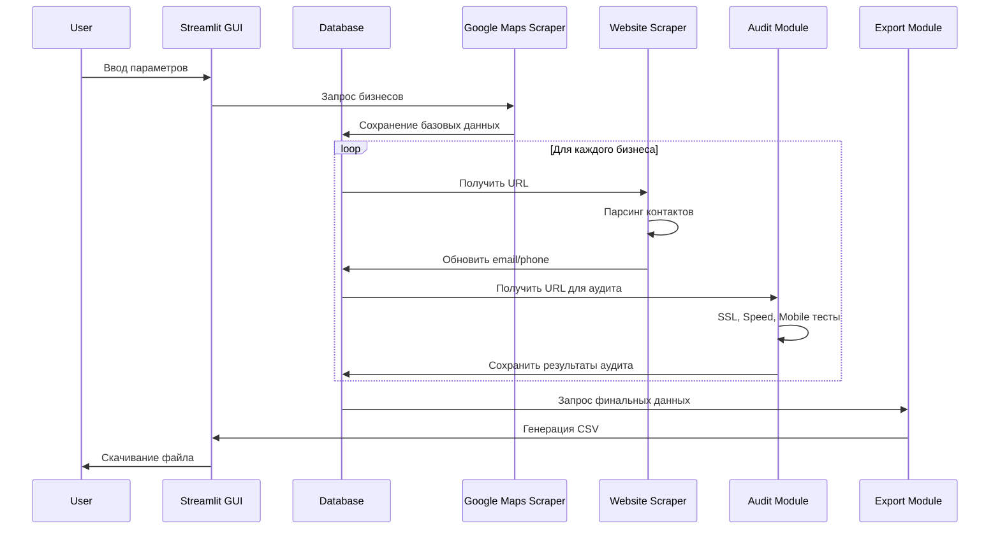
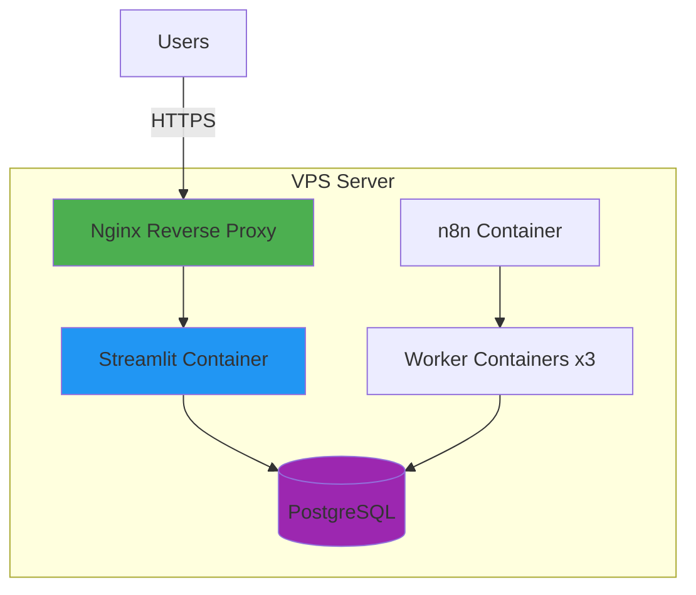

# Архитектура BrokenSite Hunter

## Обзор Системы

BrokenSite Hunter построен по модульной архитектуре, где каждый компонент выполняет специфическую функцию в общем pipeline обработки лидов.

## Компоненты Системы

### 1. Web GUI (Streamlit)
- **Назначение:** Пользовательский интерфейс для управления системой
- **Технологии:** Streamlit, Python
- **Функции:**
  - Ввод параметров поиска (страна, город, ниша)
  - Запуск процесса сбора данных
  - Мониторинг прогресса
  - Скачивание результатов

### 2. Orchestrator (n8n)
- **Назначение:** Управление workflow и автоматизация
- **Технологии:** n8n (self-hosted)
- **Функции:**
  - Планирование задач (cron jobs)
  - Координация модулей
  - Error handling и retry logic

### 3. Scraper Module
- **Назначение:** Сбор данных из Google Maps и сайтов
- **Технологии:** Scrapy, Selenium, BeautifulSoup
- **Подмодули:**
  - `google_maps.py` - Google Places API интеграция
  - `website_scraper.py` - Парсинг контактных страниц
  - `email_finder.py` - Multi-layer email enrichment

### 4. Audit Module
- **Назначение:** Технический анализ сайтов
- **Технологии:** Google Lighthouse API, SSL Labs, custom scripts
- **Подмодули:**
  - `ssl_check.py` - Проверка SSL сертификатов
  - `lighthouse.py` - PageSpeed и SEO анализ
  - `mobile_test.py` - Mobile-friendly тесты

### 5. Database Layer
- **Назначение:** Хранение и управление данными
- **Технологии:** PostgreSQL (production), SQLite (development)
- **ORM:** SQLAlchemy
- **Схема:** См. раздел "Database Schema"

### 6. Export Module
- **Назначение:** Генерация файлов для клиентов
- **Технологии:** Pandas, OpenPyXL
- **Форматы:** CSV, Excel, JSON

## Data Flow Diagram



## Database Schema

```sql
-- Таблица компаний
CREATE TABLE companies (
    id SERIAL PRIMARY KEY,
    name VARCHAR(255) NOT NULL,
    address TEXT,
    city VARCHAR(100),
    country VARCHAR(100),
    category VARCHAR(100),
    phone VARCHAR(50),
    website VARCHAR(255),
    rating FLOAT,
    reviews_count INTEGER,
    created_at TIMESTAMP DEFAULT CURRENT_TIMESTAMP,
    updated_at TIMESTAMP DEFAULT CURRENT_TIMESTAMP
);

-- Таблица контактов
CREATE TABLE contacts (
    id SERIAL PRIMARY KEY,
    company_id INTEGER REFERENCES companies(id),
    email VARCHAR(255),
    email_source VARCHAR(50), -- 'website', 'whois', 'guessed', 'hunter'
    verified BOOLEAN DEFAULT FALSE,
    social_linkedin VARCHAR(255),
    social_facebook VARCHAR(255),
    created_at TIMESTAMP DEFAULT CURRENT_TIMESTAMP
);

-- Таблица аудитов
CREATE TABLE audits (
    id SERIAL PRIMARY KEY,
    company_id INTEGER REFERENCES companies(id),
    ssl_valid BOOLEAN,
    ssl_expires_at TIMESTAMP,
    ssl_issuer VARCHAR(255),
    pagespeed_score INTEGER, -- 0-100
    fcp_ms INTEGER, -- First Contentful Paint
    lcp_ms INTEGER, -- Largest Contentful Paint
    mobile_friendly BOOLEAN,
    issues_found TEXT[], -- Массив найденных проблем
    audit_date TIMESTAMP DEFAULT CURRENT_TIMESTAMP
);

-- Индексы для производительности
CREATE INDEX idx_companies_city ON companies(city);
CREATE INDEX idx_companies_category ON companies(category);
CREATE INDEX idx_contacts_email ON contacts(email);
CREATE INDEX idx_audits_company_id ON audits(company_id);
```

## Технологические Решения

### Rate Limiting Strategy
Для предотвращения блокировок реализована multi-level стратегия:

1. **Application Level:**
   - Декоратор `@rate_limit` на функциях scraping
   - Настраиваемое количество запросов/минуту

2. **Random Delays:**
   - Случайные задержки между запросами (2-5 сек)
   - Имитация человеческого поведения

3. **User-Agent Rotation:**
   - Pool из 5+ user agents
   - Автоматическая ротация при каждом запросе

### Error Handling
- Retry logic с exponential backoff
- Graceful degradation (если email не найден, продолжаем с другими)
- Детальное логирование ошибок

### Scalability
- Асинхронная обработка где возможно (aiohttp, asyncio)
- Batching запросов к database
- Готовность к горизонтальному масштабированию (stateless workers)

## Security Considerations

1. **API Keys:** Хранятся в `.env`, не коммитятся в git
2. **Database:** Подключение через SSL в production
3. **Data Privacy:** Compliance с GDPR (опция удаления данных по запросу)

## Performance Benchmarks (Целевые)

| Метрика | MVP (Локально) | Production (VPS) |
|---------|----------------|------------------|
| Лидов/день | 100-200 | 500-1000 |
| Email покрытие | 30-50% | 50-70% |
| Среднее время/лид | 30-45 сек | 15-30 сек |
| Uptime | N/A | 99%+ |

## Deployment Architecture



## Future Enhancements

- [ ] GraphQL API для B2B интеграций
- [ ] Real-time dashboard с WebSockets
- [ ] Machine Learning для предсказания конверсии лидов
- [ ] Multi-tenancy для white-label решений
